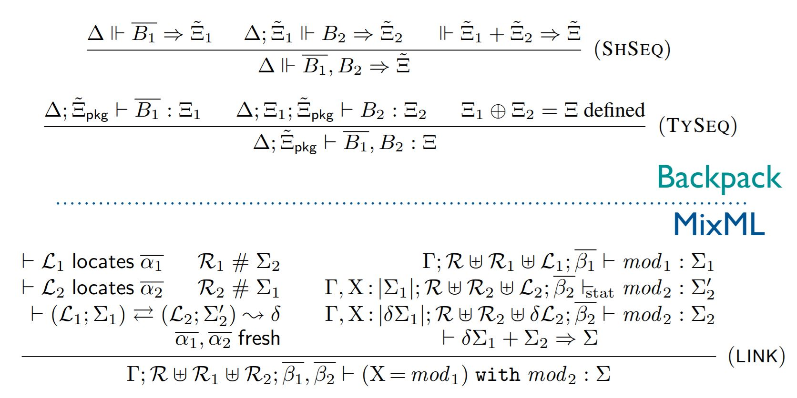

[POPL 2014 のトークスライド](http://plv.mpi-sws.org/backpack/backpack-popl.pdf)の翻訳

---

# Backpack: Retrofitting Haskell with Interfaces

- **Scott Kilpatrick** (MPI-SWS)
- Derek Dreyer (MPI-SWS)
- Simon Peyton Jones (Microsoft Research)
- Simon Marlow (Facebook)

---

## Strong Modularity

- `B` はインターフェース `A` に依存しているが，`A` とは別に型チェックをする．
  - `A` の異なる実装でインスタンス化した `B` を再利用する
  - 再帰的結び目を結ぶ前に、相互に依存するモジュールを型定義する

---

## Weak Modularity

- 実装は(既にある)実装に依存する
  - Haskell のモジュールレベル
  - Haskell のパッケージレベル

No Interface, No Strong Module !!

---

## Haskell has Weak Modularity

**それを Strong Modularity で拡張したい！！**


#### Solution

Weak Modules の上に Strong レイヤーを設計する

---

## Why not just use the ML module system ?

*なんで ML Module System (i.e. Functor) を使わないの？？*

良いところ
- ML Module System はたくさん研究・開発されている
- *Signetures* によるインターフェースと *Functor* による再利用

嫌なところ
- Functors には足りないとこ
  - 再帰的リンクと互換性が無い
  - Weak Modules に組み込む方法が分からん
- Functors は別々に行うコンパイルには適していない
  - ML 系言語は上位にシステムを追加してる

---

## Introducing Backpack

Strong Modularity で Haskell を改良する (Retrofits)
- パッケージレベルで設計した
- 簡易的な MixIn デザインを採用
- Haskell の Weak Modules の詳細(elaboration)として定義した
- 別々に型検査するが別々にコンパイルはしない

---

## Outline

- **Language tour**
- Semantics
- Future work

---

## Modules in Today’s Haskell

```haskell
-- Socket.hs
module Socket where
 data SocketT = ...
 open = ...
```
```haskell

-- Server.hs
module Server where
 import Socket
 data ServerT = ... SocketT ...
```

---

## Boot Files: Almost Interfaces

```haskell
-- Socket.hs-boot
module Socket where
 data SocketT
 open :: Int -> SocketT
```

- GHCコンパイラの実装メカニズム
- 再帰的なモジュールの "前方宣言" として使われている

---

## Packages in Backpack

```Haskell
package complete-server where
  Socket = [
    data SocketT = ...
    open = ...
  ]
  Server = [
    import Socket
    data ServerT = ... SocketT ...
  ]
```

---

## Packages in Backpack (with Holes)

```Haskell
package partial-server where
  Socket :: [
    data SocketT
    open :: Int -> SocketT
  ]
  Server = [
    import Socket
    data ServerT = ... SocketT ...
  ]
```

---

## Package Inclusion

```Haskell
package socketimpl where
  Socket = [
    data SocketT = ...
    open = ...
  ]

package complete-server where
  include socketimpl
  Server = [
    import Socket
    data ServerT = ... SocketT ...
  ]
```

---

## Package Inclusion

```Haskell
package socketsig where
  Socket :: [
    data SocketT
    open :: Int -> SocketT
  ]

package complete-server where
  include socketsig
  Server = [
    import Socket
    data ServerT = ... SocketT ...
  ]
```

---

## Linking

```Haskell
package socketsig where
  Socket :: [
    data SocketT
    open :: Int -> SocketT
  ]

package complete-server where
  include socketsig
  Server = [
    import Socket
    data ServerT = ... SocketT ...
  ]

package socketimpl where
  Socket = [
    data SocketT = ...
    open = ...
  ]

package main where
  include partial-server
  include socketimpl
```

---

## Reuse

```Haskell
package server-linked-1 where
  include partial-server
  include socketimpl-1

package server-linked-2 where
  include partial-server
  include socketimpl-2

package multi where
  A    = { include server-linked-1 }
  B    = { include server-linked-2 }
  Main = [
    import qualified A.Server
    import qualified B.Server
    ...
  ]
```

---

## Shared Reuse

```Haskell
package multi where
  C    = { include partial-server ; include socketimpl-1 }
  D    = { include partial-server ; include socketimpl-1 }
  Main = [
    import qualified C.Server
    import qualified D.Server
    ...
  ]
```

---

## Recursive Linking

```
package ab-sigs where
  A :: [ S_A ]
  B :: [ S_B ]

package b-from-a where
  include ab-sigs
  B = [ inport A ; ... ] 

package a-from-b where
  include ab-sigs
  A = [ inport B ; ... ] 

package ab-rec-sep where
  include a-form-b
  include b-form-a
```

---

## Backpack Syntax

```
[Package Names]         P ∈ PkgNames
[Module Path Names]     p ∈ ModPaths
[Package Respositories] R ::= D1,...,Dn
[Package Definitions]   D ::= package P t where B1,...,Bn
[Bindings]              B ::= p = [M] | p :: [S] | p = p | include P tr
[Thinning Specs]        t ::= (p1, ... , pn)
[Renaming Specs]        r ::= <p1 #-> p1', ... , pn #-> pn'>

[Module Expressions]    M ::= imports; exports; defns
[Signature Expressions] S ::= imports; decls
```

**Interfaces, Reuse, and Recursive linking => Strong Modularity !!**

Other features:
  - Aliasing: module name aliases (`p = p`)
  - Thinning: control module exposure
  - Renaming: control module naming/linking

---

## Outline

- Language tour
- **Semantics**
- Future work

---

## Goal 1: Base It on MixML

Start with [MixML](https://github.com/rossberg/mixml) : [Rossberg & Dreyer, ICFP ’08](https://people.mpi-sws.org/~rossberg/mixml/mixml-icfp08.pdf)

MixML は MixIn Modules を最小限で完全に表現した Core Calculus である

しかし残念ながら...
- MixML は “LTG” が目的
- MixML は shared reuse をサポートしていない
- MixML の意味論は複雑

---

## Goal 2: Retrofit Haskell

そのため，我々は改造(Retrofit)，すなわち意味論を plain Haskell Modules へ "コンパイル" する必要がある

---

## Type Representation

```Haskell
Main = [
  import qualified A.Server
  import qualified B.Server
  ... A.Server.ServerT ...
  ... B.Server.ServerT ...
]
```

---

## Module Identities

```
[Identity Variables]    α, β ∈ IdentVars
[Identity Constructors]    K ∈ IdentCtors
[Identities]               ν ::= α | K ν~ | µα.ν
```

1. holes の変数`ν_Sock`
2. インポートした Module Idents に新しいトークンを適用 `K_Ser(ν_Sock)`
3. Linking とは置換`µα.K_A(K_B(α))`
4. 循環グラフのための μ-binders (recursion) `µα.K_B(K_A(α))`

Module Identities は shared reuse and recursive linking を可能にする！！

---

## Module Identity 

(論理的な Identity ではなく，物理的な Identity ??)

```
Module Identity
  | -> Type System
  | -> Elaboration
```

---

## Type System

Package を2回たどる

1. Shaping
  - Module と Code の構造を決定する
  - Module Identities を統合する
2. Typing
  - Haskell の型検査をする
  - Shapes に Haskell の型付け情報を付け足す

---

## Type System: Linking



---

## Elaboration

- Identity ごとに1つのモジュールファイル
- コードの複製（C ++テンプレートを真似て）
- コードの大部分を保存する
- Identity へのインポートを書き直す

---

## What else is in the ~paper~ 53-page appendix ?

53ページの付録(論文？何の話？)には他に何が書いてあるの？

- Thinning と Renaming
- Haskell Modules の形式化
- Elaboration の健全性と証明
- コア言語のメタ定理と公理

---

## Outline

- Language tour
- Semantics
- **Future work**

---

## Future Work

- 型クラス
- Cabal パッケージマネージャとの統合

---

## Contributions

- Strong Modularity で Haskell を改良する
  - パッケージレベルでの設計
  - 簡易的な MixIn デザインを採用
  - Haskell の Weak Modules の詳細(elaboration)として定義した
  - 別々に型検査するが別々にコンパイルはしない
- これはジェネリックな設計なので他の Weak Module を持つ言語でも機能するだろう

---

## Thanks!

Weak Module を持つ既存の言語をすべてターゲットにするのは決して実用的とは言えない...しかしとても面白い事だ！

(Targeting an existing, weak module language is not just practical but interesting!)
